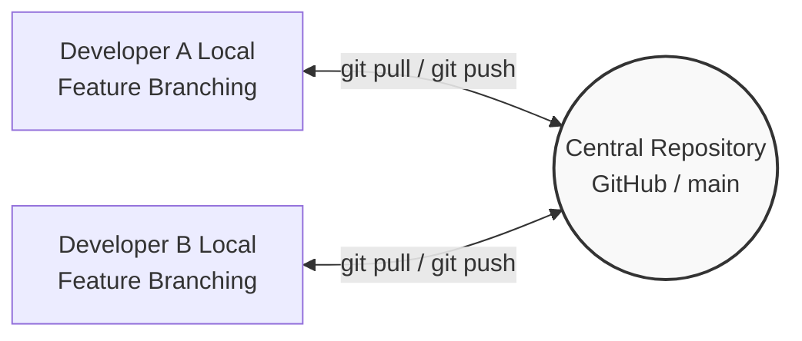
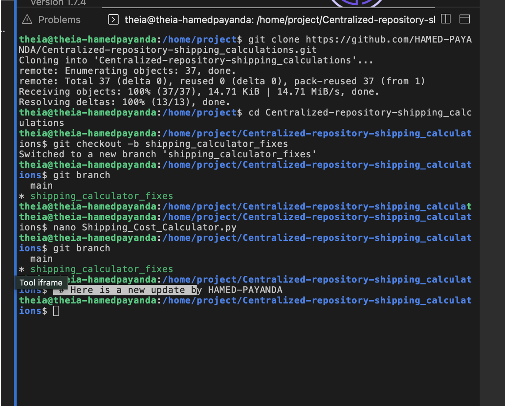
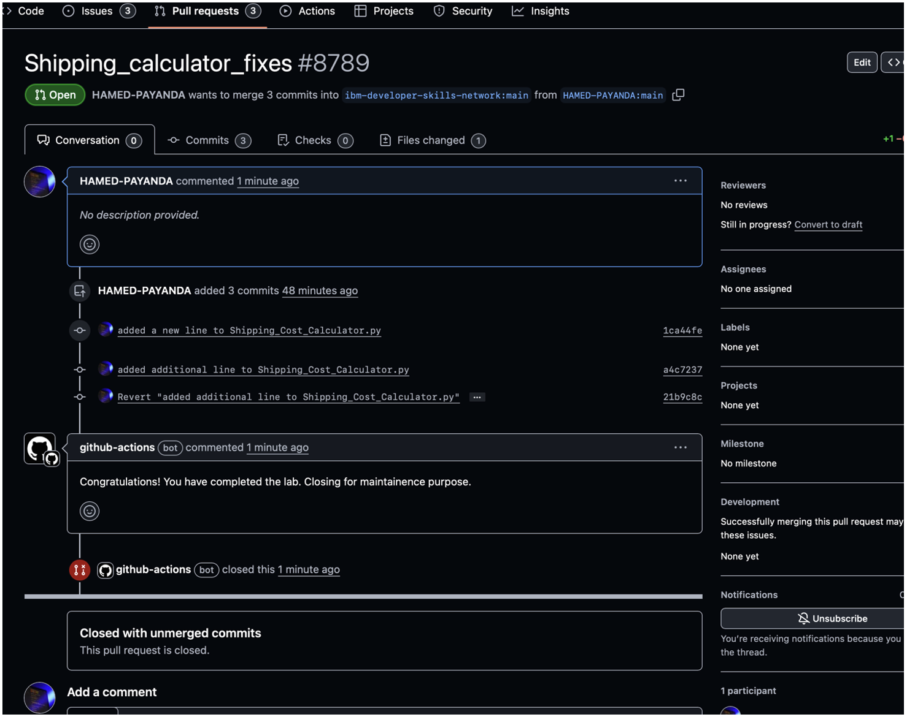
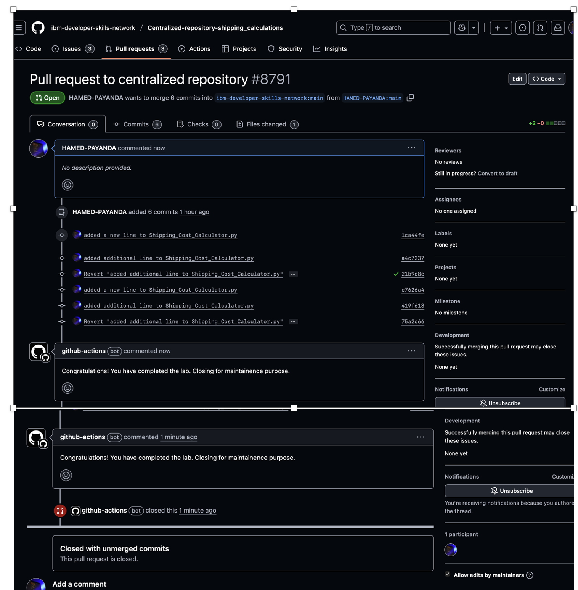

<div align="center">

# 📦 Centralized Repository: Shipping Calculations

A collaborative software engineering project demonstrating centralized Git workflows, version control, and modularized Python logic for calculating e-commerce shipping costs.

[](https://www.coursera.org/professional-certificates/ibm-full-stack-cloud-developer)
[](https://www.python.org/)
[](https://git-scm.com/)
[](https://github.com/)
[](#)

</div>

---

## 📌 Project Overview

This repository demonstrates the implementation of a **Centralized Version Control Workflow**. It serves as a shared code base where developers can collaborate on a modular script designed to process and calculate shipping rates based on various logistical parameters (e.g., weight, distance, shipping method).

By utilizing this repository, developers practice cloning, branching, committing, and resolving potential conflicts in a shared team environment, simulating real-world software collaboration.

---

## 🏗️ Git Collaboration Architecture

```text
┌────────────────────────┐         ┌────────────────────────┐         ┌────────────────────────┐
│  Developer A (Local)   │ ──────> │                        │ <────── │  Developer B (Local)   │
│  (Feature Branching)   │ <────── │   Central Repository   │ ──────> │  (Feature Branching)   │
│  git commit & push     │         │   (GitHub / `main`)    │         │  git commit & push     │
└────────────────────────┘         └────────────────────────┘         └────────────────────────┘
```

---

## ✨ Key Features

* **Centralized Workflow:** Simulates an industry-standard collaborative environment using a central GitHub repository.
* **Single Source of Truth:** The `main` branch acts as the production-ready, authoritative codebase.
* **Modular Codebase:** Shipping calculation logic is isolated into clean, reusable Python functions.
* **Collaborative Updates:** Demonstrates fetching, pulling, and merging team changes before pushing new features to avoid conflicts.
Core Workflow Principles Implemented:
•	Single Source of Truth: The main branch acts as the production-ready codebase.
•	Modular Codebase: Shipping calculation logic is isolated into clean, reusable functions.
•	Collaborative Updates: Fetching and pulling the latest team changes before pushing new features.
---
## 🛠️ Core Tech Stack & Tools

* **Language:**  — Core logic for the shipping calculation algorithm.
* **Version Control:**  — Tracking code changes and managing local repositories.
* **Hosting Platform:**  — Centralized collaboration and code sharing.
* **Environment:** 💻 **Cloud IDE / Terminal** — Code execution and CLI Git commands.
---
## 📸 Visual Proof

The following screenshots document the chronological, end-to-end Git workflow utilized in this project, from local branching to remote pull request management.

**Step 1: Local Development & Feature Branching**  
*The workflow begins in the local terminal. This view demonstrates cloning the centralized repository, creating an isolated feature branch (`shipping_calculator_fixes`), and preparing the environment for local code modifications without affecting the production `main` branch.*


**Step 2: Initial Pull Request & Commit Reversion**  
*After pushing local changes, an initial Pull Request (#8789) is opened. The commit history showcases practical version control management, including the deliberate reversion of a specific commit to maintain codebase stability, culminating in an automated review by GitHub Actions.*


**Step 3: Centralized Workflow Integration**  
*The final stage shows a subsequent pull request (#8791) managing an extended history of iterative commits. This illustrates the ongoing contribution cycle to a centralized repository and the successful automated closure of the completed task by the GitHub Actions bot.*


---

📁 Repository Structure
```text
Centralized-repository-shipping_calculations/
├── .github/
│   └── workflows/
│       └── close_pr.yml           # GitHub Actions workflow for automated PR management
├── .DS_Store                      # macOS custom directory attributes 
├── .gitignore                     # Specifies intentionally untracked files to ignore in Git
├── CODE_OF_CONDUCT.md             # Community guidelines for repository contributors
├── CONTRIBUTING.md                # Instructions and standards for contributing code
├── LICENSE                        # Open-source license file
├── README.md                      # Main project documentation
├── Shipping_Cost_Calculator.py    # Core Python script for shipping calculations
├── screenshot1.png                # Visual proof: Local terminal workflow
├── screenshot2.png                # Visual proof: Pull request and commit history
└── screenshot3.png                # Visual proof: Multiple commits and automation
```
---

⚙️ Step-by-Step Execution
1. Repository Setup & Cloning
To begin working on this shared repository locally:
```text
git clone [https://github.com/HAMED-PAYANDA/Centralized-repository-shipping_calculations.git](https://github.com/HAMED-PAYANDA/Centralized-repository-shipping_calculations.git)
cd Centralized-repository-shipping_calculations
```

2. Developing the Calculation Logic
Developed Python functions to calculate shipping fees based on modular variables like item weight and destination zones.

3. Version Control Workflow
Tracking changes and pushing updates to the centralized server:
```text
# Add modifications to the staging area
git add .

# Commit with a descriptive message
git commit -m "feat: implement dynamic weight-based shipping calculation"

# Push to the central repository
git push origin main
```
---

💻 Code Snippet Example
(If you have a specific code snippet from your script, you can replace this example block!)
```text
def calculate_shipping(weight, rate_per_kg):
    """
    Calculates the total shipping cost.
    """
    total_cost = weight * rate_per_kg
    return total_cost

# Example Usage
print(f"Total Shipping Cost: ${calculate_shipping(10.5, 2.00)}")
```
---
# 🤝 Contributing (Logistics Shipping Rates)
Please consider the below factors while contributing

Code Style:
Maintain a consistent code style for readability.

Documentation:
Ensure well-documented code for effective collaboration.

Testing:
Thoroughly test your changes before submitting a pull request.

Issue Tracker:
Check the Issue Tracker for tasks.

Code Review:
All contributions undergo a code review process.

Licensing:
This project is licensed under the [Apache 2.0 License](LICENSE).

---

## 👤 Author

**Hamed Payanda**
* **GitHub:** [@HAMED-PAYANDA](https://github.com/HAMED-PAYANDA)
* Completed as part of the **IBM Full-Stack Software Developer Professional**.


